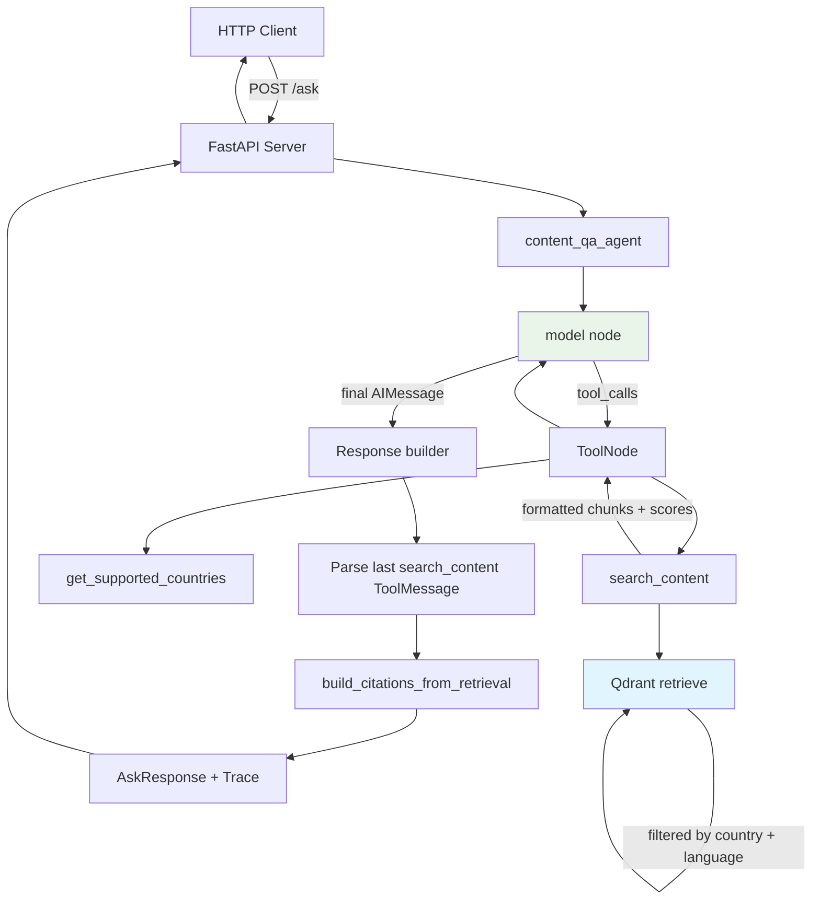

# System Architecture

## High-Level Flow

```
HTTP Request → FastAPI /ask → LangGraph (model ↔ tools) → Qdrant + LLM → normalize answer → citations & trace → HTTP Response
```

## Detailed Architecture




## Component Details

### 1. LangGraph Agent (`content_qa_agent`)

**State:** `ContentQAState` extends LangGraph `MessagesState` (plus optional `remaining_steps` for step limits).

**Nodes:**
- **`model`**: Loads system prompt from `src/prompts/content_qa_agent_system_prompt.txt`, binds `content_qa_tools`, invokes the chat model.
- **`tools`**: `ToolNode` executing `search_content` and `get_supported_countries`.

**Edges:** `model` → if last `AIMessage` has `tool_calls` → `tools` → `model`; otherwise → `END`.

**Retrieval & fallback:** `search_content` calls `retrieve()` with metadata filters. If nothing is found for the preferred language, it iterates over **supported languages for that country** (see `COUNTRY_LANGUAGES` in `tools.py`) until results exist or all are exhausted.

### 2. Multi-Tenant Data Isolation

**Qdrant Metadata Structure (per point):**

```json
{
  "content_id": "b_faq_returns_es",
  "country": "B", 
  "language": "es",
  "type": "FAQ",
  "version": 1.0,
  "title": "¿Cuál es su política de devoluciones?",
  "body": "Puede devolver cualquier artículo...",
  "updated_at": "2025-10-01T00:00:00Z"
}
```

**Query-time Filtering:**

```python
metadata_filter = Filter(must=[
    FieldCondition(key="country", match=MatchValue(value="B")),
    FieldCondition(key="language", match=MatchValue(value="es"))
])
```

### 3. Citation Pipeline (API Layer)

1. **Retrieval**: `search_content` returns a human-readable block per hit, including **Content ID**, **Language**, **Score** (Qdrant similarity), and **Content** (body).
2. **Synthesis**: The model produces an answer and may cite sources as `[1]`, `[2]` inline.
3. **Parsing**: `parse_retrieved_documents_from_search_content_output` in `api.py` maps tool output to indexed documents; excerpts are a **truncated prefix** of each body (see `MAX_EXCERPT_LEN`).
4. **Assembly**: `build_citations_from_retrieval` aligns citations with `[n]` markers when present; **`match_score`** comes from the parsed **Score** field (clamped to `[0, 1]`).

There is no separate `extract_citations` graph node; citation objects are built in FastAPI from the last `search_content` `ToolMessage` plus the final assistant text.

### 4. Language Fallback (inside `search_content`)

```python
# Example: Country B supports en + es. Typical order:
#   - If requested language is in the map: try it first.
#   - If requested language is not "en" and "en" is supported: try "en" next.
# (Not every locale is tried—only this constructed list.)

for search_lang in search_languages:
    results = retrieve(query, country=country, language=search_lang, top_k=top_k)
    if results:
        return formatted_context(...)
return "No relevant content found..."
```

The LLM is instructed to answer in the user’s **preferred language** when possible, even if chunks were retrieved from another language in that list .

## Data Flow Example

**Input:**

```json
{
  "question": "¿Cuál es su política de devoluciones?",
  "country": "B",
  "language": "es"
}
```

**Processing:**

1. **Validate**: `AskRequest` — country B, language `es` → valid (422 if invalid country).
2. **Embed**: Question → embedding vector (384-dim).
3. **Agent**: Model calls `search_content` → Qdrant with `country=B` and language loop starting from `es`.
4. **Results**: Spanish chunks (e.g. `b_faq_returns_es`) with similarity scores.
5. **Synthesize**: Model answers with optional `[1]`, `[2]` citations.
6. **Response build**: API parses tool output → `Citation` list + `Trace.retrieval_count`.

**Output (shape):**

```json
{
  "answer": "Puede devolver cualquier artículo dentro de los 7 días [1]...",
  "language_used": "es",
  "citations": [{
    "content_id": "b_faq_returns_es",
    "type": "FAQ",
    "excerpt": "Puede devolver cualquier artículo dentro de los 7 días...",
    "match_score": 0.91
  }]
}
```

(`language_used` echoes the request; `trace` follows `src/schema/models.py`.)

## Key Design Decisions

### 1. Pre-filtering vs Post-filtering

- **Chosen**: Pre-filtering with Qdrant metadata filters  
- **Rationale**: Guarantees isolation, no risk of cross-country leakage
- **Alternative**: Retrieve top-K globally, then filter → risky

### 2. Tool Agent vs Large Explicit DAG

- **Chosen**: Small LangGraph with `bind_tools` + `ToolNode`
- **Rationale**: Matches modern agent patterns; retrieval policy is centralized in `search_content`
- **Alternative**: Many hand-written nodes (validate → retrieve → …) → more boilerplate for this scope

### 3. Local vs API Embeddings

- **Chosen**: Local sentence-transformers
- **Rationale**: No rate limits, faster iteration, cost predictable
- **Alternative**: OpenAI/Cohere embeddings → better multilingual quality

### 4. Citation Scores

- **Chosen**: Qdrant similarity from tool output, combined in the API with **answer–body overlap** when excerpt alignment is non-trivial (`build_citations_from_retrieval`)
- **Rationale**: Keeps retrieval signal while nudging scores when the cited span clearly aligns with the generated answer
- **Alternative**: Pure vector score only, or pure string match only — each misses part of the story

## Scalability Considerations

### Current Limitations

- **Single-node Qdrant**: No horizontal scaling
- **Synchronous LLM calls**: No request batching  
- **In-memory embeddings**: Model loaded per process
- **No caching**: Every query hits vector DB + LLM

### Production Scaling

- **Qdrant cluster**: Distributed vector search
- **LLM async batching**: Process multiple requests together
- **Redis caching**: Cache frequent queries and embeddings
- **Load balancing**: Multiple API instances behind ALB
- **Connection pooling**: Reuse DB connections

