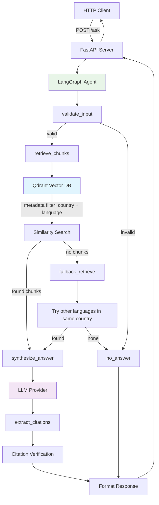

# System Architecture

## High-Level Flow

```
HTTP Request → FastAPI → LangGraph Agent → Qdrant → LLM → HTTP Response
```

## Detailed Architecture



## Component Details

### 1. LangGraph State Machine

**State Schema:**
```python
class AgentState(TypedDict):
    question: str
    country: str  
    language: str
    retrieved_chunks: list[dict]
    fallback_used: bool
    fallback_language: str | None
    answer: str
    citations: list[dict]
    llm_failed: bool
    error: str | None
    route: str
```

**Node Flow:**
```
START → validate_input → retrieve → [fallback_retrieve] → synthesize → extract_citations → END
                      ↓                    ↓               ↓
                   no_answer ←────────────────────────────────
```

### 2. Multi-Tenant Data Isolation

**Qdrant Metadata Structure:**
```json
{
  "content_id": "b_faq_returns_es",
  "country": "B", 
  "language": "es",
  "type": "FAQ",
  "version": 1.0,
  "title": "¿Cuál es su política de devoluciones?",
  "body": "Puede devolver cualquier artículo...",
  "updated_at": "2025-10-01T00:00:00Z"
}
```

**Query-time Filtering:**
```python
metadata_filter = Filter(must=[
    FieldCondition(key="country", match=MatchValue(value="B")),
    FieldCondition(key="language", match=MatchValue(value="es"))
])
```

### 3. Citation Pipeline

1. **Retrieval**: Qdrant returns chunks with similarity scores
2. **Synthesis**: LLM generates answer with inline citations `[1]`, `[2]`
3. **Extraction**: Parse citations and extract relevant excerpts
4. **Verification**: Compute match scores between excerpts and source content

### 4. Language Fallback Logic

```python
# Country A supports: ["en", "hi"]  
# Query: country="A", language="es" (not supported)

for fallback_lang in ["en", "hi"]:
    chunks = retrieve(query, country="A", language=fallback_lang)
    if chunks:
        return synthesize_with_translation(chunks, target_lang="es")
        
return no_answer_response()
```

## Data Flow Example

**Input:**
```json
{
  "question": "¿Cuál es su política de devoluciones?",
  "country": "B",
  "language": "es"
}
```

**Processing:**
1. **Validate**: Country B, language es → valid
2. **Embed**: Question → [0.1, -0.3, 0.7, ...] (384-dim vector)
3. **Retrieve**: Query Qdrant with filters `country=B AND language=es` 
4. **Results**: `b_faq_returns_es`, `b_tc_es_v3` (Spanish content only)
5. **Synthesize**: LLM generates Spanish answer with `[1]`, `[2]` citations
6. **Extract**: Parse citations, compute match scores
7. **Response**: Structured JSON with answer + citations

**Output:**
```json
{
  "answer": "Puede devolver cualquier artículo dentro de los 7 días [1]...",
  "citations": [{
    "content_id": "b_faq_returns_es",
    "excerpt": "Puede devolver cualquier artículo dentro de los 7 días...",
    "match_score": 0.91
  }]
}
```

## Key Design Decisions

### 1. Pre-filtering vs Post-filtering
- **Chosen**: Pre-filtering with Qdrant metadata filters  
- **Rationale**: Guarantees isolation, no risk of cross-country leakage
- **Alternative**: Retrieve top-K globally, then filter → risky

### 2. LangGraph vs Linear Pipeline  
- **Chosen**: LangGraph with explicit state machine
- **Rationale**: Interview requirement, easier fallback logic, testable
- **Alternative**: Simple function chain → less flexible

### 3. Local vs API Embeddings
- **Chosen**: Local sentence-transformers
- **Rationale**: No rate limits, faster iteration, cost predictable
- **Alternative**: OpenAI/Cohere embeddings → better multilingual quality

### 4. Citation Verification Method
- **Chosen**: String similarity with SequenceMatcher  
- **Rationale**: Simple, reliable, interpretable scores
- **Alternative**: Semantic similarity with embeddings → more sophisticated

## Scalability Considerations

### Current Limitations
- **Single-node Qdrant**: No horizontal scaling
- **Synchronous LLM calls**: No request batching  
- **In-memory embeddings**: Model loaded per process
- **No caching**: Every query hits vector DB + LLM

### Production Scaling
- **Qdrant cluster**: Distributed vector search
- **LLM async batching**: Process multiple requests together
- **Redis caching**: Cache frequent queries and embeddings
- **Load balancing**: Multiple API instances behind ALB
- **Connection pooling**: Reuse DB connections